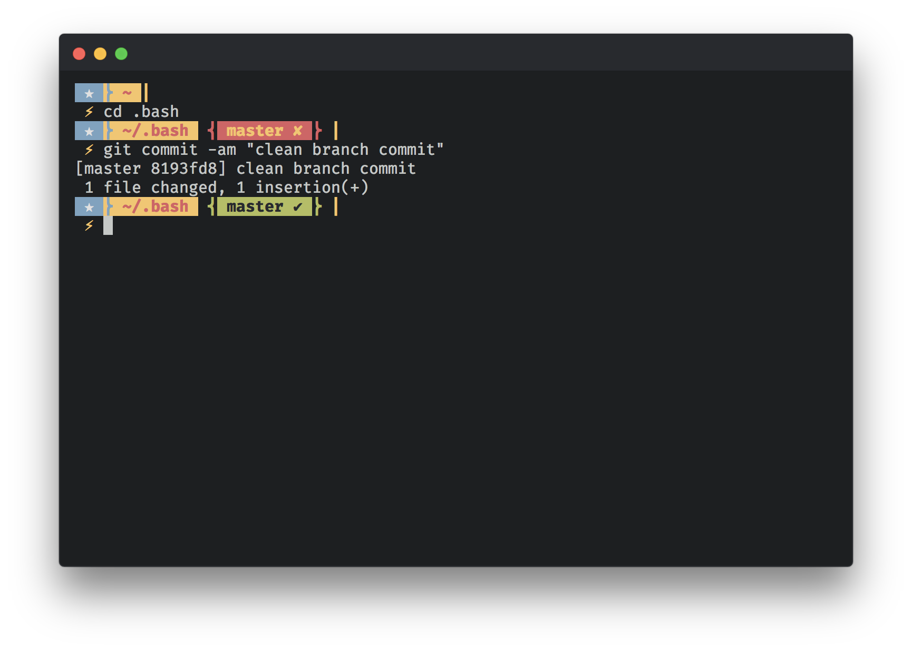

# Bash Configs

### File description
- __README.md__ - This file
- __.aliases__ - alias definitions
- __.profile__ - bash design and colors
- __.environments__ - basic environment settings
- __.bashrc__ - the main RC file


## Terminal View
Design inspired by [Wild Cherry](https://github.com/mashaal/wild-cherry)


### Branch  Emojis
> 👍 Clean

> 💩 Dirty

## Install
``` shell
$ git clone https://github.com/whosdustin/bash.git .bash
```
In the computer root add a `.bash_profile` and place the following code inside.
```
if [ ! -f $HOME/.bashrc ]; then
  source $HOME/.bash/.bashrc
fi
```

Close your terminal and reopen.

**Done.**

_Notes_: you might find the following show up at the top.
```
-bash: /Users/<name>/.bash/.private: No such file or directory
-bash: /Users/<name>/.npm/nvm: No such file or directory
```
You will need to install nvm as my profile uses nvm for node. You can [install nvm here](https://github.com/creationix/nvm#install-script).

The `.private` file is for you to add TOKENS such as Github.
